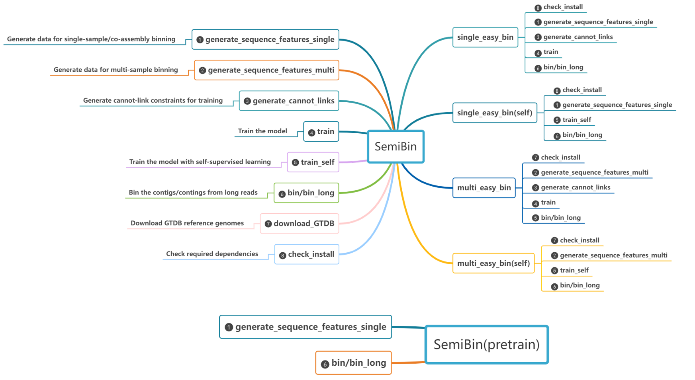

## SemiBin Subcommand Reference

See the [usage](usage) page for a more readable overview of how SemiBin can be used.
This page exhaustively lists all the subcommands and their options.

SemiBin works using a _subcommand_ interface.
Most uses are covered by either the `single_easy_bin` or `multi_easy_bin` subcommands, but you can use the other subcommands for more control.

### single_easy_bin

Reconstruct bins with single or co-assembly binning using one command.

`single_easy_bin` requires the contig file (assembly from reads), BAM files (reads mapping to the contig) as inputs and outputs reconstructed bins in the output_recluster_bins directory (see [[how to generate inputs for SemiBin](../generate)] and [[usage](../usage)] for more information).

#### Required arguments

* `-i/--input-fasta` : Path to the input contig fasta file (`gzip` and `bzip2` compression are accepted).
* `-b/--input-bam`: Path to the input BAM (`.bam` extension)  or CRAM (`.cram`) files. You can pass multiple BAM files, one per sample.
* `-o/--output`: Output directory (will be created if non-existent).
* `-a/--abundance` Path to the abundance file from strobealign-aemb. This can only be used when samples used in binning above or equal 5.

#### Recommended arguments

If your data comes from one of the habitats for which we have a prebuilt model, using the `--environment` argument will use it instead of training a new model.

* `--environment`: Environment for the built-in model (`human_gut`/`dog_gut`/`ocean`/`soil`/`cat_gut`/`human_oral`/`mouse_gut`/`pig_gut`/`built_environment`/`wastewater`/`chicken_caecum`/`global`).

If `--environment` is not given, a new model is learned, which is computationally intensive.

* [SemiBin 1.4 and above] `--self-supervised` or `--semi-supervised`: specify the training algorithm used
* [SemiBin 1.3] `--training-type`: Training algorithm used to train the model (`semi`/`self`). This is still accepted for backwards compatibility, but deprecated.

The [original manuscript describing SemiBin1](https://doi.org/10.1038/s41467-022-29843-y) presents the semi-supervised approach.
Starting in version 1.3, self-supervised learning is also supported, which should be an improvement in both results and computational resource usage.

* [SemiBin 1.4 and above] `--sequencing-type=short_reads`/`--sequencing-type=long_reads`

#### Optional arguments to control output

* `--compression`: Whether to compress outputs to save space. Should be one of `none` (default if using `SemiBin`) / `gz` (default if using `SemiBin2`) / `xz` / `bz2`.
* `--tag-output`: If passed an argument (_e.g._, `--tag-output=mysample`), then output bin files will include the tag. This can help distinguish results from multiple runs.

#### Optional arguments to control computational resource usage

* `-p/--processes/-t/--threads`: Number of CPUs used (`0`, the default, indicates that all CPUs should be used).
* `--write-pre-reclustering-bins`/`--no-write-pre-reclustering-bins`: Whether to write pre-reclustering bins (defaults to true in SemiBin1; and false in SemiBin2).
* `--engine`: device used to train the model (`auto`/`gpu`/`cpu`); `auto` (default) means that SemiBin with attempt to detect and use GPU and fallback to CPU if no GPU is found.
* `--tmpdir`: set temporary directory.
* `-r/--reference-db-data-dir`: GTDB reference directory (Default: `$HOME/.cache/SemiBin/mmseqs2-GTDB`). This is only useful if you are using the deprecated semi-supervised mode). In that case, SemiBin will lazily download GTDB if it is not found there. Note that a lot of disk space is used.

#### Optional arguments to set internal parameters

* `--random-seed`: Random seed to reproduce results.
* `--orf-finder` : gene predictor used to estimate the number of bins. Must be one of `prodigal` (default since `v0.7`), `fast-naive` (available since `v1.5`, this is a very fast internal implementation, default if using `SemiBin2`), or `fraggenescan` (which is faster than `prodigal`, but cannot be installed in all platforms and is still not as fast as the `fast-naive` method).

#### Optional arguments to bypass internal steps

Several internal steps can be bypassed if you wish to compute it outside of SemiBin.
For example, calling mmseqs2 for contig annotation takes a lot of time and if you perform it for your dataset independently of SemiBin, you can reuse the results here and avoid recomputation.

These should be considered advanced uses as passing wrongly formatted files can easily lead to suboptimal or non-sensical results.

* `--taxonomy-annotation-table`: TAXONOMY_TSV, Pre-computed mmseqs2 format taxonomy TSV file to bypass mmseqs2 GTDB annotation. When running with multi-sample binning, please make sure that the order of the taxonomy TSV file and the contig file (used for the combined fasta) is same.
* `--depth-metabat2`: depth file generated by metabat2 (only used with single-sample binning).
* `--prodigal-output-faa`: predicted protein coding genes from the contigs used for binning. The important element is that predicted protein coding genes must be named following the format `{contig}_{index}` where `{contig}` is the contig name and `{index}` is some ORF identifier, separated by a single underscore. Prodigal uses this format, but not all tools do.

#### Optional arguments to set internal parameters (advanced)

Generally speaking, you should use the default values for all these parameters, but they are provided if you want to tune the algorithms.
If you find that changing these significantly improves the results of binning, we would appreciate if you [got in touch](mailto:luispedro@big-data-biology.org).

* `--minfasta-kbs`: minimum bin size in kilo-basepairs (Default: 200).
* `--no-recluster` : Do not recluster bins. This saves a small amount of time, but pre-reclustering bins are always output.
* `--epochs`: Number of epochs used in the training process (Default: 15).
* `--batch-size`: Batch size used in the training process (Default: 2048).
* `--max-node`: Percentage of contigs that considered to be binned (Default: 1).
* `--max-edges`: The maximum number of edges that can be connected to one contig (Default: 200).
* `--ratio` : If the ratio of the number of base pairs of contigs between 1000-2500 bp smaller than this value, the minimal length will be set as 1000bp, otherwise 2500bp. If you set -m parameter, you do not need to use this parameter. If you use SemiBin with multi steps and you use this parameter, please use this parameter consistently with all subcommands (Default: 0.05).
* `-m/--min-len` : Minimal length for contigs in binning. If you use SemiBin with multi steps and you use this parameter, please use this parameter consistently with all subcommands. (Default: SemiBin chooses 1000bp or 2500bp according the ratio of the number of base pairs of contigs between 1000-2500 bp).
* `--ml-threshold` : Length threshold for generating must-link constraints. By default, the threshold is calculated from the contigs, and the default minimum value is 4,000 bp.
* `--cannot-name:` Name for the cannot-link file (Default: `cannot`).

### multi_easy_bin

Reconstruct bins with multi-samples binning using one-line command.

The command `multi_easy_bin` requires the combined contig file from several samples, BAM files (reads mapping to the combined contig) as inputs and outputs the reconstructed bins in the `samples/[sample]/output_recluster_bins` directory.

#### Required arguments

* `-b/--input-bam`: Path to the input BAM (`.bam`) or CRAM (`.cram`) files. You can pass multiple BAM files, one per sample.
* `--input-fasta` and `--output`are same as for `single_easy_bin`.

#### Optional arguments

* `-s/--separator`: Used when multiple samples binning to separate sample name and contig name (Default is `:`).
* [SemiBin 1.4 and above] `--self-supervised` or `--semi-supervised`: specify the training algorithm used
* [SemiBin 1.3] `--training-type`: Training algorithm used to train the model (`semi`/`self`). This is still accepted for backwards compatibility, but deprecated.
* `--reference-db-data-dir`, `--processes`, `--minfasta-kbs`, `--recluster`,`--epochs`, `--batch-size`, `--max-node`, `--max-edges`, `--random-seed`, `--ratio`, `--min-len`, `--ml-threshold`, `--no-recluster`, `--orf-finder`，`--engine` and `--tmpdir` are same as for `single_easy_bin`

### generate_cannot_links

:::{warning}
This is only useful for using the older (deprecated) semi-supervised approach
:::

Run the contig annotations using mmseqs with GTDB and generate `cannot-link` file used in the semi-supervised deep learning model training.

The subcommand `generate_cannot_links` requires the contig file as inputs and outputs the `cannot-link` constraints.

#### Required arguments

* `--input-fasta`
* `--output`

These are the are same as for `single_easy_bin`.

#### Optional arguments

* `--cannot-name`
* `-r/--reference-db-data-dir`
* `--ratio`
* `--min-len`
* `--ml-threshold`
* `--taxonomy-annotation-table`
* `--tmpdir`
* `-a/--abundance`

These are the are same as for `single_easy_bin`.

### generate_sequence_features_single

The subcommand `generate_sequence_features_single` requires the contig file and BAM file(s) as inputs and generates training data (`data.csv`; `data_split.csv`) for single and co-assembly binning.

#### Required arguments

* `-i/--input-fasta`
* `-b/--input-bam`
* `-o/--output`
* `-a/--abundance`

These are the are same as for `single_easy_bin`.

#### Optional arguments

* `-p/--processes/-t/--threads`
* `--ratio`
* `--min-len`
* `--ml-threshold`
* `--depth-metabat2`
* `--tmpdir`

These are same as for `single_easy_bin`.

### generate_sequence_features_multi

The subcommand `generate_sequence_features_multi` requires the combined contig file and BAM files as inputs and generates training data (`data.csv` and `data_split.csv` files) for multi-sample binning.

#### Required arguments

* `-i/--input-fasta`
* `-o/--output`
* `-b/--input-bam`
* `-a/--abundance`

These are the same as for `multi_easy_bin`.

#### Optional arguments

* `-p/--processes/-t/--threads`, `--ratio`, `--min-len`, `--ml-threshold` and `--tmpdir` are the same as for `single_easy_bin`.
* `-s/--separator` are the same as for `multi_easy_bin`.

### train (`train_semi` in SemiBin2)

The `train` (`train_semi` in `SemiBin2`) subcommand requires the contig file and outputs from the `generate_sequence_features_single`, `generate_sequence_features_multi` and `generate_cannot_links` subcommand as inputs (`data.csv`, `data_split.csv` and `cannot.txt`) and outputs the trained model.

Note that you can train a model from multiple samples for use in single sample binning!

#### Required arguments

* `-i/--input-fasta` (same as for `single_easy_bin`)
* `-o/--output` (same as for `single_easy_bin`)
* `--data`: Path to the input `data.csv` file (typically generated by a previous call to `generate_sequence_features_single` or `generate_sequence_features_multi`).
* `--data_split`: Path to the input `data_split.csv` file.
* `-c/--cannot-link` : Path to the input cannot link file generated from other additional biological information, one row for each cannot link constraint. The file format is comma separated: `contig_1,contig_2`.
* [SemiBin 1.4 and above] `--train-from-many`: When passed, train models from many samples (training across several samples can result in a better pre-trained model for single-sample binning). When this flag is used, you must pass `data`, `data_split`, `cannot`, and `fasta` files for corresponding sample in the exact same order. *Note:* You can only use this option when single-sample binning. Training from many samples with multi-sample binning is not supported (see [[training](../training/)] for more information).
* [Before SemiBin 1.4] `--mode`: [single/several] Prior to SemiBin 1.4, using `--mode=several` was used for the same purpose as using `--train-from-many`. This option is still accepted for backwards compatibility, but is deprecated.

#### Optional arguments

* `--epochs`
* `--batch-size`
* `-p/--processes/-t/--threads`
* `--random-seed`
* `--ratio`
* `--min-len`
* `--orf-finder`
* `--engine`

These have the same meaning as for `single_easy_bin`

### train_self

The `train_self` subcommand requires the contig file and outputs from the `generate_sequence_features_single`, `generate_sequence_features_multi`  subcommand as inputs (`data.csv`, `data_split.csv`) and outputs the trained model with a self-supervised way.

#### Required arguments

* `-o/--output` (same as for `single_easy_bin`)
* `--data`: Path to the input `data.csv` file (typically generated by a previous call to `generate_sequence_features_single` or `generate_sequence_features_multi`).
* `--data_split`: Path to the input `data_split.csv` file.
* [SemiBin 1.4 and above] `--train-from-many`: When passed, train models from many samples (training across several samples can result in a better pre-trained model for single-sample binning). When this flag is used, you must pass `data`, `data_split`, and `fasta` files for corresponding sample with same order. *Note:* You can only use this option when single-sample binning. Training from many samples with multi-sample binning is not supported (see [[training](../training/)] for more information).
* [Before SemiBin 1.4] `--mode`: [single/several] Prior to SemiBin 1.4, using `--mode=several` was used for the same purpose as using `--train-from-many`. This option is still accepted for backwards compatibility, but is deprecated.

#### Optional arguments

* `--epochs`
* `--batch-size`
* `-p/--processes/-t/--threads`
* `--random-seed`
* `--engine`

These have the same meaning as for `single_easy_bin`

### bin_short

The `bin_short` subcommand (for backwards compatibility reasons, `bin` is accepted as an alias) requires the contig file and output (files `data.csv`, `model.h5`) from the `generate_sequence_features_single`, `generate_sequence_features_multi` and `train` subcommand as inputs and output the final bins in the `output_recluster_bins` directory.

#### Required arguments

* `--data` (same as for `train`)
* `i/--input-fasta` (same as for `single_easy_bin`)
* `-o/--output` (same as for `single_easy_bin`)

Also, one of the following two arguments is required:

* `--environment`: Which pre-trained model to use (see `single_easy_bin`)
* `--model`: Path to the trained model

See [[training](../training/)] for more information on how models can be generated.

#### Optional arguments

* `--minfasta-kbs`, `--recluster`, `--max-node`, `--max-edges`, `-p/--processes/-t/--threads`, `--random-seed`, `--environment`, `--ratio`, `--min-len`, `--no-recluster`, `--orf-finder`, `--engine` and `--depth-metabat2` are the same as for `single_easy_bin`

### bin_long

The `bin_long` subcommand requires the contig file and output (files `data.csv`, `model.h5`) from the `generate_sequence_features_single`, `generate_sequence_features_multi` and `train` subcommand as inputs and output the final bins in the `output_bins` directory.

#### Required arguments

* `--data` (same as for `train`)
* `i/--input-fasta` (same as for `single_easy_bin`)
* `-o/--output` (same as for `single_easy_bin`)

Also, one of the following two arguments is required:

* `--environment`: Which pre-trained model to use (see `single_easy_bin`)
* `--model`: Path to the trained model

See [[training](../training/)] for more information on how models can be generated.

#### Optional arguments

* `--minfasta-kbs`, `-p/--processes/-t/--threads`, `--random-seed`, `--environment`, `--ratio`, `--min-len`, `--orf-finder`, `--engine` and `--depth-metabat2` are the same as for `single_easy_bin`

### download_GTDB

Download reference genomes (GTDB).
This is used for semi-supervised learning when learning a new model.

* `-r/--reference-db-data-dir`: Where to store the GTDB data (default: `$HOME/.cache/SemiBin/mmseqs2-GTDB`)
* `-f/--force`: Whether to download GTDB even if the data is found at the path (default is to not download).

If you download GTDB to a different directory than the default, you should then pass that path to every command (`-r`) to ensure that it is found.

### check_install

Checks whether required dependencies are available (useful for trouble-shooting).

#### Optional argument

* `--allow-missing-mmseqs2` [since SemiBin 1.4]: When used, failure to find `mmseqs` will not lead to an error.

### concatenate_fasta

Concatenate fasta files for multi-sample binning.
The contigs are renamed to include the sample name followed by a separator character.
The separator character cannot occur in any of your samples, so if any sample contains the default separator (`:`), you must change it and pass that information to every command (using the `--separator`/`-s` argument).

#### Required arguments

* `-i`/`--input-fasta` (same as for `single_easy_bin`)
* `-o`/`--output` (same as for `single_easy_bin`)

#### Optional arguments

* `-s`/`--separator` is the same as the `multi_easy_bin` (see comment above).
* `-m`: Discard sequences below this length (default:0).
* `--compression` (since version `1.6`): whether to compress the output (defaults to `gz` if using `SemiBin2`)

### citation

_Available since version 2.1_

Prints citation

#### Optional argument

* `--bibtex`: Use BibTeX format
* `--ris`: Use RIS format (for Endnote and other tools)
* `--chicago`: Use Chicago format (default)
